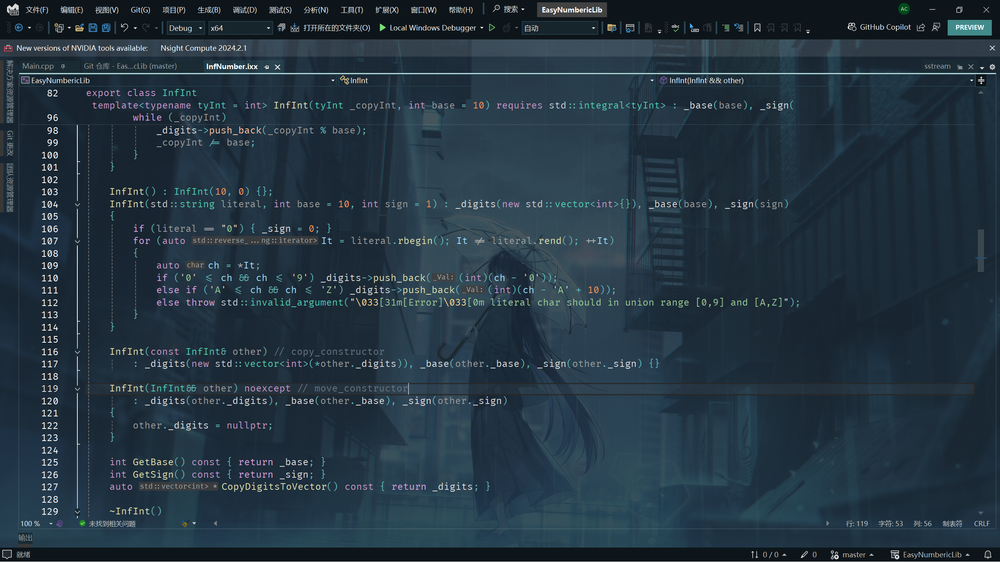

# EasyNumbericLib

[](./README.md)
[](./Readme_CN.md)

## About

A simple numerical arithmetic library (not finished!)

This `Readme` is typographically supported by [shields.io](https://shields.io/).



## Table of Contents

- [Installation](#Installation)
- [Usage](#Usage)
- [Contribute](#Contribute)
- [License](#License)
- [Contact](#Contact)

## Install

Put all the `ifc` files (which will go live in a future release) into your project directory or a known folder, and set the project properties in `MSVC`:
```
Configuration Properties -> C/C++ -> General -> Additional Include Directories
```

`MSVC` will automatically compile and find the `ifc` file, but you can also compile it manually.
You can also compile it manually.

```
cl /std:c++20 yourcode.cpp /module:import binaryfiles.ifc
```

Of course, you can also just clone the source code and compile the `ixx` files yourself.

If you are on a Linux or POSIX subsystem (e.g., `gcc` / `clang`, etc.), you can compile the `ixx` source code by replacing the `ixx` suffix with `cpp`, but you may need to modify the code yourself if it depends on the `MSVC` compiler.

### Prerequisites

This project is written in modules and uses constraints, `std::format`, etc., so you need to make sure that your environment is at least `C++20` or above. It is recommended to use `C++20` in `MSVC` and then enable modules for compilation.

## Usage

An example is `Main.cpp` in the project source code.
```C++
import InfNumber.

import <iostream>;
import <limits>.

int main()
{
	InfInt n(-240); auto m = n.Abs(); auto m = n.
	auto m = n.Abs(); std::cout << std::format("{}, {}, ",")
	std::cout << std::format("{}, {}", n, *m) << std::endl; n.BaseConvert(16); n.BaseConvert(16); m = n.
	n.BaseConvert(16);
	std::cout << n << std::endl;
	InfInt var("28515155", 10, -1);
	std::cout << std::format("{}, {}, {}", var, *var.Abs(), var.ToInt()) << std::endl;
	InfInt var_24(-451645142, 24);
	std::cout << var_24 << std::endl;
}
```

## Contribute

## License

[](./LICENSE.txt)

This project is licensed under the GPL-3.0 License - see the [LICENSE](./LICENSE.txt) file for details.

## Contact

Feel free to contact me!
- Github : [FlowerCA77](https://github.com/FlowerCA77/)
- eMail : `ca538468142@outlook.com`

Translated with www.DeepL.com/Translator (free version)