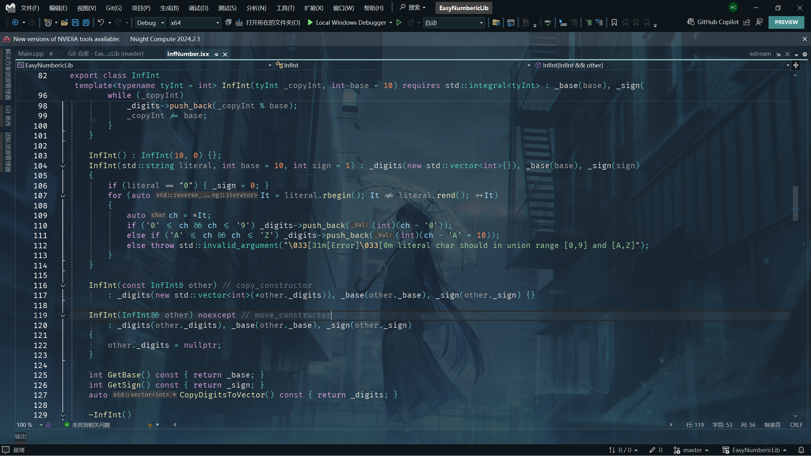

# EasyNumbericLib

[](./README.md)
[](./Readme_CN.md)

## 关于

一个简易的数值运算库（没写完！）

本`Readme`由 [shields.io](https://shields.io/) 提供排版支持。



## 目录

- [安装](#安装)
- [使用](#使用)
- [贡献](#贡献)
- [许可证](#许可证)
- [联系](#联系)

## 安装

把全部 `ifc` 文件 (未来会上线到 release 中) 放入你的工程目录或已知文件夹，在 `MSVC` 中设置项目属性：
```
配置属性 -> C/C++ -> 常规 -> 附加包含目录
```
`MSVC` 会自动编译找到 `ifc` 文件，当然你也可以手动编译
```sh
cl /std:c++20 yourcode.cpp /module:import binaryfiles.ifc
```

当然你也可以直接 clone 源代码下来, 自行编译 `ixx` 文件

如果你在 Linux 或 POSIX 子系统环境下 (如 `gcc` / `clang` 等) ，可以把 `ixx` 源代码后缀名换成 `cpp` 来编译，当然你可能需要自行修改代码中依赖于 `MSVC` 编译器的内容。

### 先决条件

本项目使用模块编写，并且用到了约束、`std::format` 等内容，所以你需要保证你的环境至少在 `C++20` 标准以上。建议在 `MSVC` 中使用 `C++20` ，然后启用模块进行编译。

## 使用

项目源代码中 `Main.cpp` 就是一个例子。
```c++
import InfNumber;

import <iostream>;
import <limits>;

int main()
{
	InfInt n(-240);
	auto m = n.Abs();
	std::cout << std::format("{}, {}", n, *m) << std::endl;
	n.BaseConvert(16);
	std::cout << n << std::endl;
	InfInt var("28515155", 10, -1);
	std::cout << std::format("{}, {}, {}", var, *var.Abs(), var.ToInt()) << std::endl;
	InfInt var_24(-451645142, 24);
	std::cout << var_24 << std::endl;
}
```

## 贡献

## 许可证

[](./LICENSE.txt)

This project is licensed under the GPL-3.0 License - see the [LICENSE](./LICENSE.txt) file for details.

## 联系

欢迎联系我！
- Github : [FlowerCA77](https://github.com/FlowerCA77/)
- eMail : `ca538468142@outlook.com`